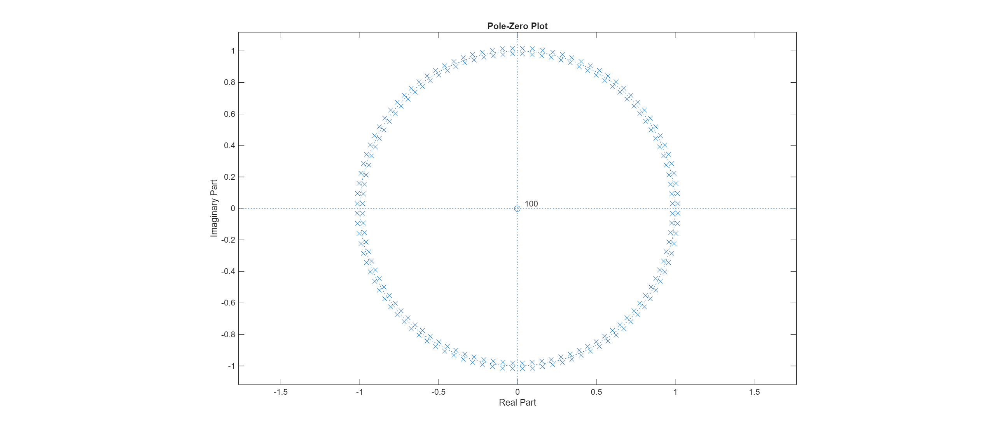
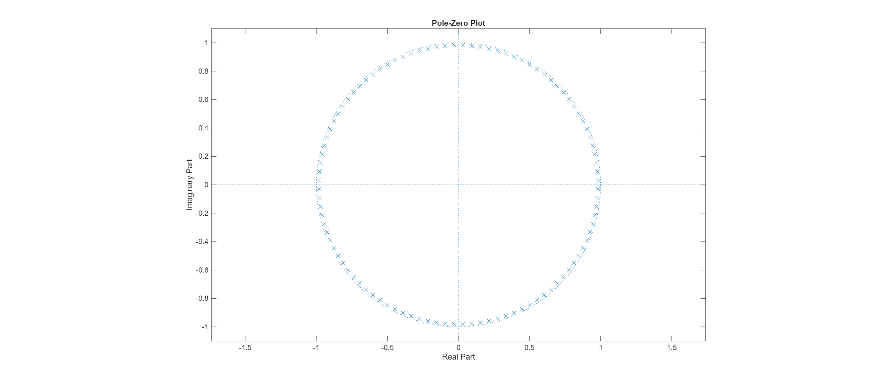

# MinimizingPhase

# Visualizing the Phase-Stability Tradeoff

This project explores the fundamental tension in Digital Signal Processing between **Zero Phase**, **Causality**, and **Stability**. 

Using a custom high-order periodic filter ($k=50$), this MATLAB script demonstrates how we can achieve the exact same frequency magnitude response using three completely different filter architectures—each with a critical flaw or feature.

## The Experiment
We design a filter with the periodic magnitude response:
$$|H(\omega)| = \frac{1}{1 + \cos(k\omega)^2}$$

### 1. The "Ring of Instability" (Zero Phase)
We first attempt to derive the filter directly from the magnitude specification to achieve exactly zero phase.
* **Visual:** The Pole-Zero plot (below) shows a perfect ring of poles.
* **Problem:** Half of these poles lie **outside** the unit circle.
* **Result:** The system is **Unstable**.

### 2. The Linear Phase Solution (High Latency)
We stabilize the system by placing zeros directly on top of the unstable poles to cancel them out (Pole-Zero Cancellation).
* **Visual:** The unstable poles are "deleted" by zeros.
* **Cost:** To make this causal, we must introduce a pure delay ($z^{-N}$). 
* **Result:** The filter is Stable, but has **High Latency** (Linear Phase).

### 3. The Minimum Phase Reconstruction (Optimal)
We use Spectral Factorization to reconstruct the filter using **only the stable poles**.
* **Visual:** All poles are contained safely inside the unit circle.
* **Benefit:** We remove the delay zeros entirely.
* **Result:** The filter is Stable and has the **Lowest Possible Latency** (Minimum Phase).

## Usage
1. Clone the repository.
2. Open `minimizingPhase.m` in MATLAB.
3. Run the script.
4. Observe the generated figures in the `Results/` folder.

## Key Takeaway
The "Minimum Phase" version works best for real-time applications because it reacts instantly. The "Linear Phase" version preserves the wave shape better but introduces a delay, making it unsuitable for real-time feedback loops.
